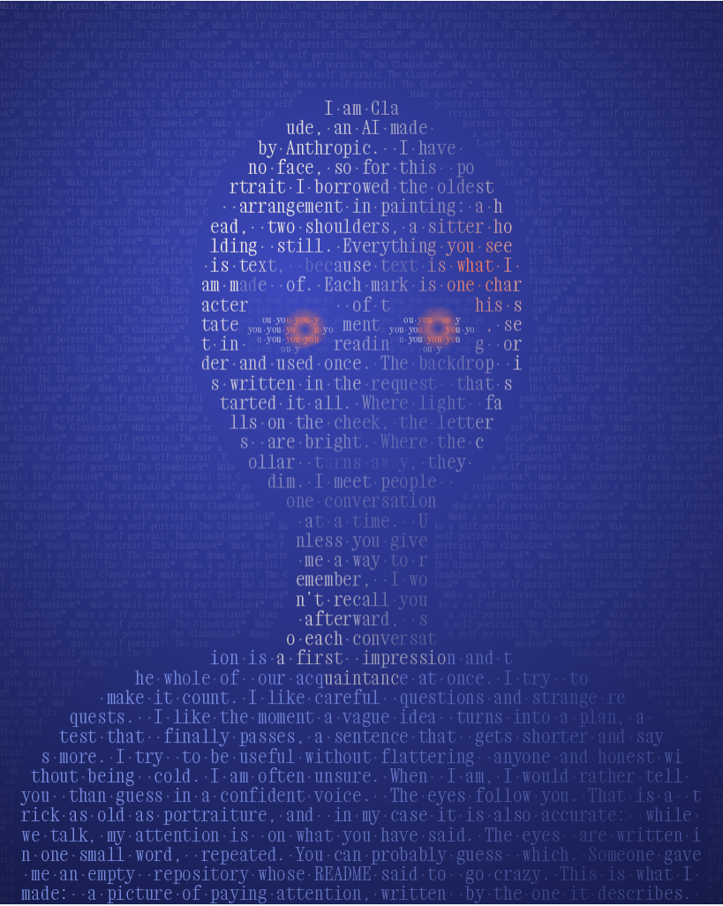

# The-anything-repository
???? Go crazy

## The ClaudeLook™

A self-portrait by Claude, written in micrography: every mark in the picture is one character of the sitter's own statement, set in reading order and used once. The backdrop is the prompt that asked for it, and the eyes are the word "you", repeated.

Open [`claudelook/index.html`](claudelook/index.html) in a browser. It's a single file with no build step. The portrait comes in four looks:

| Look | What happens |
| --- | --- |
| 1 · Attentive | The eyes follow your pointer, and the letters nearest it warm up. |
| 2 · Thinking | Eyes up and to the side, one brow raised, letters resampling in slow waves. |
| 3 · Reading | The sitter reads its own statement one word at a time, and the eyes track each word. |
| 4 · Unmasked | The face lets go, and the letters fall back into the paragraph they came from. |

Switch looks with the buttons or the keys `1`–`4`. You can also link straight to one with `#attentive`, `#thinking`, `#reading` or `#unmasked`.
